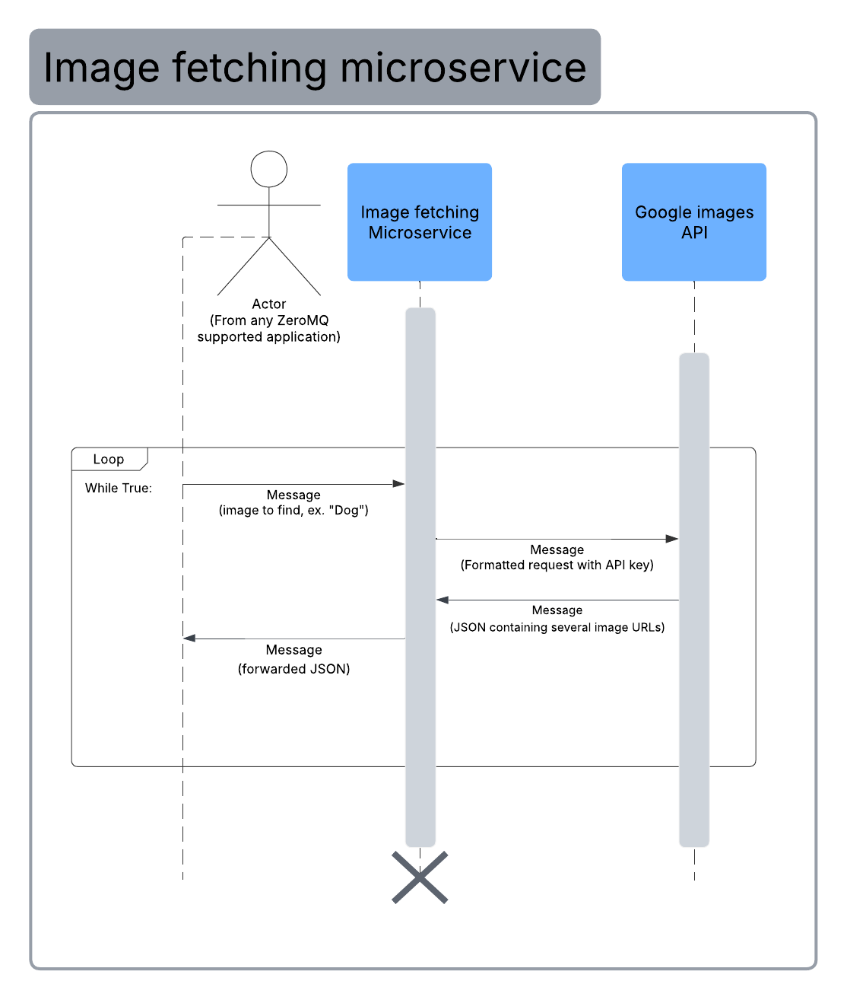

# Image Fetching Microservice

## Setup
### Requirements/Installations
* Language-specific ZeroMQ package
* Google API Key
* [Python Google API Documentation](https://pypi.org/project/Google-Images-Search/)
### Command to Install Depedencies
```python3
pip install google-api-python-client
pip install zmq
```

## Usage
### UML Sequence Diagram


### Startup
First, put your API Key into service.py. Next, start server.py in a python virtual environment (unless you've installed dependencies globally). Run the server with a command like `python3 server.py`.
To use the microservice, begin by writing code that instantiates a TCP zmq socket (we suggest port 1738). Example python code is shown below:
```python3
import zmq

PORT = 1738
context = zmq.Context()

socket = context.socket(zmq.REQ)
socket.connect(f"tcp://localhost:{PORT}")
```
The microservice is now ready to receive as many requests as your Google API Key is allowed to provide.

### Requesting data
Simply send your query (such as "Dog" or "Mountain sunset") through the socket created in the startup phase. You may have to convert your string object into a byte string or similar structure to send it through the socket.
```python3
query = "Dog"
socket.send(query.encode())
```

### Receiving data
After sending a query through the socket, receive the response by listening for a response over the socket. If you had to encode your query before sending it, you'll likely have to decode the response.
The message will be in a JSON format, so using a function to put it into a proper object may be desired. This may require importing a package. Using a regular expression to grab the first result is another viable option.
```python3
import json

response = socket.recv()
message = response.decode("utf-8")
json_object = json.loads(message)
```
